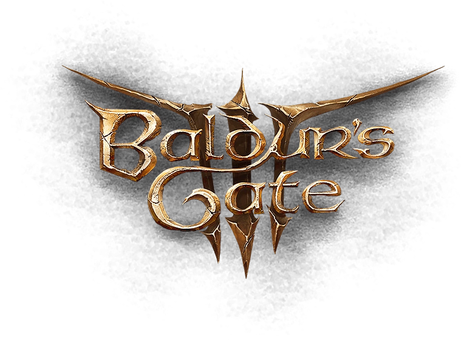

### Getting Baldur's Gate 3 to run on Arch Linux





### What we know so far

[Larian Studios]() just released the early access for [Baldur's Gate
3](://baldursgate3.game/) yesterday and with most Linux gamers, the burning
question always remains: Will it run on my system? The answer, "It's complicated".

Currently, BG3 is supported natively on Windows and macOS. In a recent
[interview](https://community.stadia.com/t5/Stadia-Community-Blog/Interview-with-Larian-Studios-on-Baldur-s-Gate-3-arriving/ba-p/28400)
with Larian Studios, support for early access on Stadia have been confirmed.
This is somewhat good news for Linux users as Stadia is powered by Linux and is
based on [Vulkan API](https://github.com/KhronosGroup/Vulkan-Headers). But that
doesn't mean it will be released outside of Stadia. Still, there is some hope
for support with Wine/Proton.

Now enough of the back story, let's get into how I got BG3 to work on my Arch
Linux system.

## Specs

I am running the following specs:

- CPU: `AMD Ryzen 7 3700x`
- GPU: `AMD Radeon VII`
- OS:  `Arch Linux - 5.8.13-arch1-1`

To be upfront, I've only tested this only on an AMD GPU but the process should
be the same for NVIDIA GPUs. Also as a note, I've bought and installed the early access version
on Steam.


## Errors galore

Steam uses Proton, which is a fork of Wine, to allow Linux users to run games not supported natively on Linux. So I was confident that BG3 would work. Or so I thought...

I've been using the RAD drivers for a while now and all the games on Steam seemed to work, but when I tried to launch
BG3 on Steam, I'd get a bunch of errors:

```
ERROR: ld.so: object '/home/peterk/.local/share/Steam/ubuntu12_32/gameoverlayrenderer.so' from LD_PRELOAD cannot be preloaded (wrong ELF class: ELFCLASS32): ignored.
wine: Call from 0x7b010c6e to unimplemented function mscoree.dll.GetTokenForVTableEntry, aborting
wine: Call from 0x7b010c6e to unimplemented function mscoree.dll.GetTokenForVTableEntry, aborting
wine: Call from 0x7b010c6e to unimplemented function mscoree.dll.GetTokenForVTableEntry, aborting
wine: Call from 0x7b010c6e to unimplemented function mscoree.dll.GetTokenForVTableEntry, aborting
wine: Call from 0x7b010c6e to unimplemented function mscoree.dll.GetTokenForVTableEntry, aborting
Unhandled exception. System.Runtime.InteropServices.SEHException (0x80004005): External component has thrown an exception.
   at LariLauncher.Cef.CefHelper.Initialize()
   at LariLauncher.App.OnStartup(StartupEventArgs e)
   at System.Windows.Application.<.ctor>b__1_0(Object unused)
   at System.Windows.Threading.ExceptionWrapper.InternalRealCall(Delegate callback, Object args, Int32 numArgs)
   at System.Windows.Threading.ExceptionWrapper.TryCatchWhen(Object source, Delegate callback, Object args, Int32 numArgs, Delegate catchHandler)
   at System.Windows.Threading.DispatcherOperation.InvokeImpl()
   at System.Windows.Threading.DispatcherOperation.InvokeInSecurityContext(Object state)
   at MS.Internal.CulturePreservingExecutionContext.CallbackWrapper(Object obj)
   at System.Threading.ExecutionContext.RunInternal(ExecutionContext executionContext, ContextCallback callback, Object state)
--- End of stack trace from previous location where exception was thrown ---
   at System.Threading.ExecutionContext.RunInternal(ExecutionContext executionContext, ContextCallback callback, Object state)
   at System.Threading.ExecutionContext.Run(ExecutionContext executionContext, ContextCallback callback, Object state)
   at MS.Internal.CulturePreservingExecutionContext.Run(CulturePreservingExecutionContext executionContext, ContextCallback callback, Object state)
   at System.Windows.Threading.DispatcherOperation.Invoke()
   at System.Windows.Threading.Dispatcher.ProcessQueue()
   at System.Windows.Threading.Dispatcher.WndProcHook(IntPtr hwnd, Int32 msg, IntPtr wParam, IntPtr lParam, Boolean& handled)
   at MS.Win32.HwndWrapper.WndProc(IntPtr hwnd, Int32 msg, IntPtr wParam, IntPtr lParam, Boolean& handled)
   at MS.Win32.HwndSubclass.DispatcherCallbackOperation(Object o)
   at System.Windows.Threading.ExceptionWrapper.InternalRealCall(Delegate callback, Object args, Int32 numArgs)
   at System.Windows.Threading.ExceptionWrapper.TryCatchWhen(Object source, Delegate callback, Object args, Int32 numArgs, Delegate catchHandler)
   at System.Windows.Threading.Dispatcher.LegacyInvokeImpl(DispatcherPriority priority, TimeSpan timeout, Delegate method, Object args, Int32 numArgs)
   at MS.Win32.HwndSubclass.SubclassWndProc(IntPtr hwnd, Int32 msg, IntPtr wParam, IntPtr lParam)
   at MS.Win32.UnsafeNativeMethods.DispatchMessage(MSG& msg)
   at System.Windows.Threading.Dispatcher.PushFrameImpl(DispatcherFrame frame)
   at System.Windows.Threading.Dispatcher.PushFrame(DispatcherFrame frame)
   at System.Windows.Threading.Dispatcher.Run()
   at System.Windows.Application.RunDispatcher(Object ignore)
   at System.Windows.Application.RunInternal(Window window)
   at System.Windows.Application.Run()
   at LariLauncher.App.Main()
```

## The Workaround

Judging by what's being thrown, it seems to be an issue with the launcher on steam and Wine. So instead, I tried running Wine directly to see if I can bypass the Launcher:

```
> wine --version
wine-5.18 (Staging)

> wine /datassd/Games/SteamLibrary/steamapps/common/Baldurs\ Gate\ 3/bin/bg3.exe
```

But the game would crash and would give me an error complaining about Vulkan. So I referenced the [Vulkan](https://wiki.archlinux.org/index.php/Vulkan) wiki page on Arch Linux and tried the AMDVLK Open Source drivers to see if that would work.

```
sudo pacman -Rns vulkan-radeon
sudo pacman -S amdvlk
```

After that, I was able to run the binary via Wine using the above Wine command!

You can probably do the same with NVIDIA based GPUs by installing the Vulkan drivers included in the `nvidia-utils` package on Arch Linux:

```
sudo pacman -S nvidia-utils
```

## Steam Launcher issue

So I've played around with `winetricks` to see if I could get the Steam Launcher working for BG3 by downloading the latest dotnet framework, but all of my attempts failed with a bunch of errors since `winetricks` invoke 32-bit libraries and my system is 64-bit. The dotnet48 was able to finish installing, but the launcher still doesn't work. I'll have to dig into the errors and do some research on this. If I get to a working solution, I'll go ahead and add another note to my blog.

## Rejoice!

So in short, by bypassing the Steam game launcher and running Wine directly, we're able to run BG3 on a Linux system. We also learned that for AMD, the RAD drivers were not sufficient enough for Wine to run the game as it was throwing errors related to Vulkan. Switching to the AMDVLK open source drivers solves the problem for Wine. This process can be done on another distro with its respective package manager or building these packages from source.
